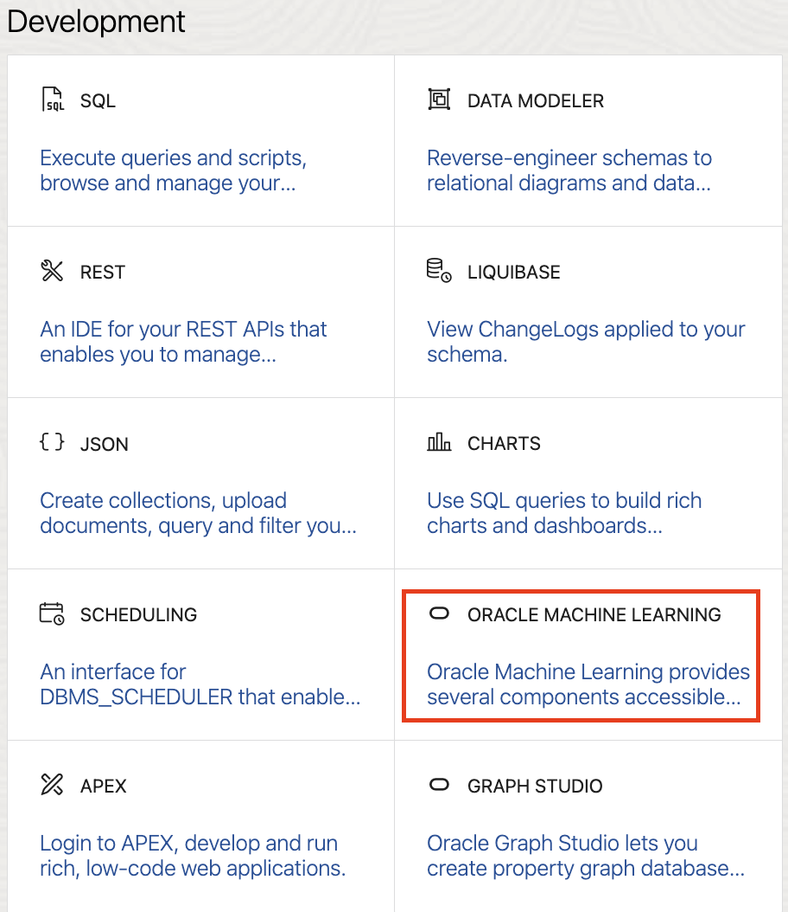
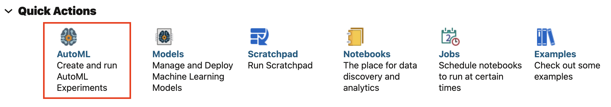
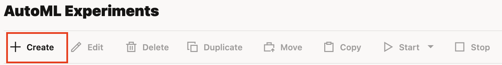
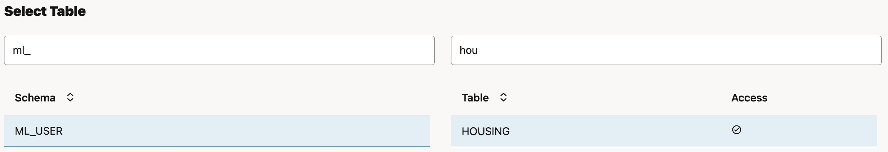
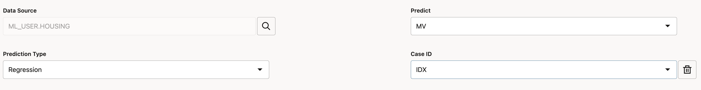
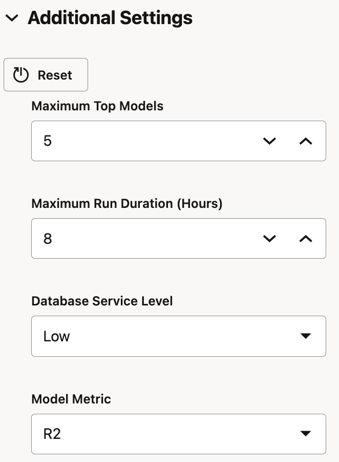
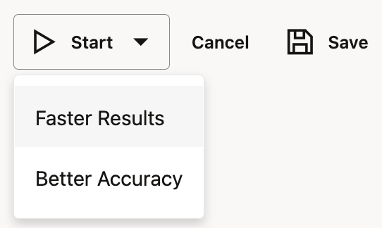
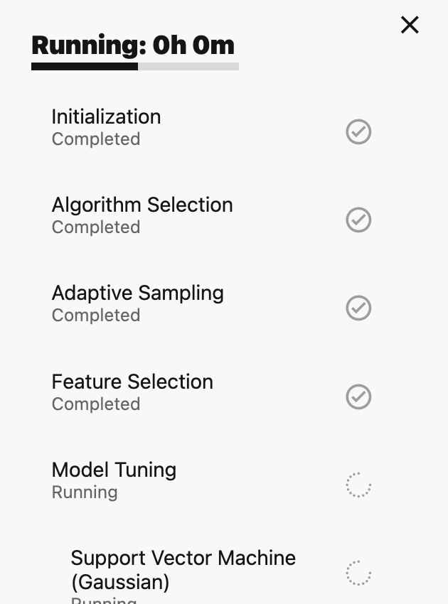
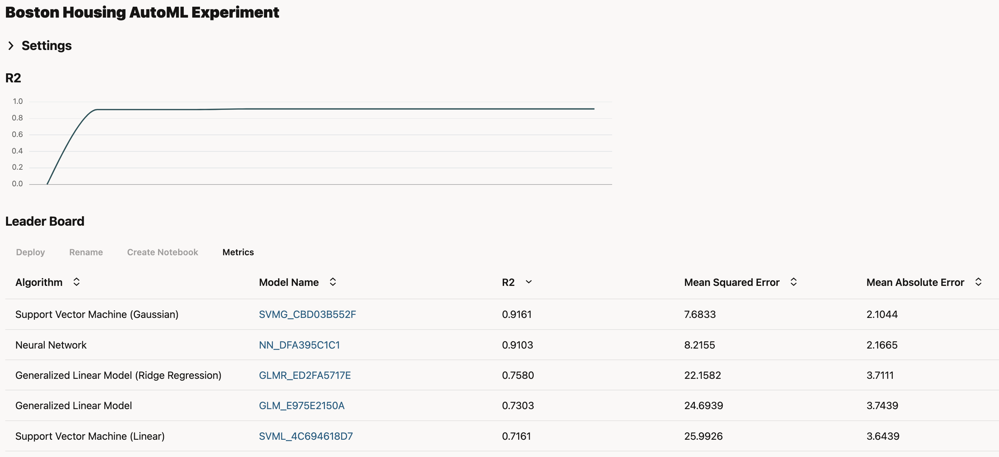

# Using AutoML in Oracle Analytics

Approximately one year ago, I have written a blog post [Training and deploying AutoML models in Oracle Data Lakehouse](https://zigavaupot.blogspot.com/2022/03/training-and-deploying-automl-models-in.html). This blog post was part of my Oracle Data Lakehouse blog series, was focusing on training and deploying AutoML models in Oracle Autonomous Data Warehouse (ADW).

Besides that, the post was also focusing on storing and managing data files in object storage and registering them as external tables in ADW.

AutoML generated models are stored and deployed in ADW as any other OML models. If you want to use these models in Oracle Analytics you have to manually register OML model with Oracle Analytics and use it. There is a small detail regarding the location of data to be used with such a model - data has to reside in the same database where model is deployed. Not to mention, that user has to log into OML Notebooks in ADW and perform the training there.

In the latest, March 2023 Update, release this is no longer needed as Oracle Analytics is now capable of using that same AutoML functionality directly from Data Flows.

Let’s look at example. And let’s start with “traditional” approach. Later we’ll check out how can same example be used with the newest functionality.

### Data

Before we start with an example, let’s check select data. Let’s take one that is already prepared and is used more than frequently in these kind of show cases. We’ll use the [Boston Housing dataset](https://archive.ics.uci.edu/ml/machine-learning-databases/housing/). 

For more information, you can also check out my blog post [Housing Price Prediction in Oracle Data Visualisation](https://zigavaupot.blogspot.com/2020/05/housing-price-prediction-in-oracle-data.html).

### Using AutoML in Autonomous Data Warehouse

Oracle Machine Learning is one of the development tools within Oracle Autonomous Data Warehouse.

Oracle Machine Learning is actually implementation of Zeppelin Notebooks with database. You can use notebooks to create and deploy machine learning models whereby Oracle Machine Learning supports use of SQL, PL/SQL, R and Python. When using AutoML, this is done by using so called **Experiments**. 

AutoML runs experiments (ie. searching for the best model)using Python.

Using AutoML experiments is pretty straightforward. Users are not required to know a lot of machine learning. Basic understanding is probably enough. However, preparing data for machine learning is another story and we are not dealing with that in this blog post. Dataset we are using is already pre-prepared and no additional action is needed in that regards.

AutoML starts by creating an experiment.

In the beginning, besides experiment name and comments, a database table with data for model training is selected. In this small experiment, HOUSING table is selected.

Once database table is selected, parameters like predictor, case id and prediction type are selected. In our example, attribute MV is predictor, case ID is column IDX and predition type is already selected based on the predictor selection.

.

There are some other Additional settings, which can be optionally set. For example, R2 is selected instead of Mean Squared Error as model metric.

This is basically it! AutoML experiment is ready to be started. There are two options how you would like to run the experiment, Faster Results or Better Accuracy. Choose one and just start.

Based on the setting, AutoML experiment will run. Progress can be tracked in **Running** window.

In the main page, you can monitor results of models run and tested in the Leader Board.

### Registering AutoML model with Oracle Analytics Cloud

### Using AutoML from OAC Data Flows

### Conclusion