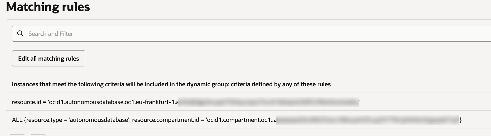
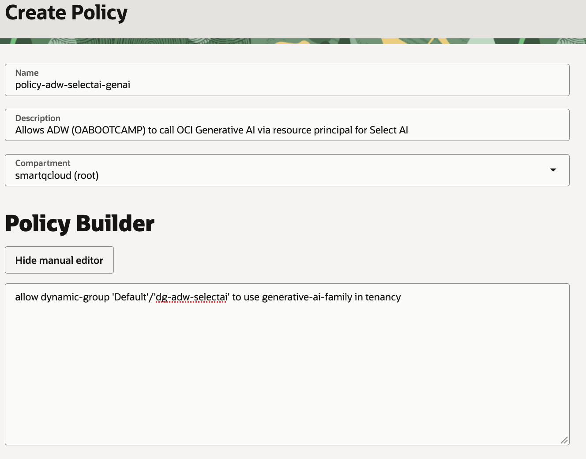

# Select AI Agent meets OPAF, Part 2: Connecting Autonomous Database to OCI Generative AI


With the schema prepared in Part 1, the next step is giving Select AI an LLM to work with. In my setup the database calls OCI Generative AI with its own resource principal, so no API keys are stored anywhere in the database.

In this part I check that the database version and the model support what I need, set up the IAM dynamic group and policy, enable the resource principal and network access, create the Select AI profile that every later flow in the series uses, and run a few smoke tests to confirm that the comments from Part 1 actually shape the generated SQL.

## Checking the environment

`v$instance` is not readable by a regular ADB user, so I check the version with `product_component_version`:

```sql
SELECT product, version_full FROM product_component_version;
```

The result is `Oracle AI Database 26ai Enterprise Edition 23.26.4.1.0`. `DBMS_CLOUD_AI_AGENT` requires 23.26 or later on 26ai, so Select AI Agent is available.

In the OCI GenAI Playground (Chat) in Germany Central (Frankfurt) I confirmed that `openai.gpt-oss-120b` is available on-demand. Fallback models in the same region are `meta.llama-3.3-70b-instruct`, `cohere.command-a-03-2025` and `google.gemini-2.5-*`.

<!-- TODO: OCI GenAI Playground screenshot (01-genai-playground-models.png) is missing — decide later -->


## IAM: dynamic group and policy

The database needs IAM permission to call OCI Generative AI.

1. Copy the ADW OCID: **Oracle Database → Autonomous Database → (my ADW) → OCID → Copy**.
2. **Identity & Security → Domains → Default → Dynamic groups → Create dynamic group**.
3. Name: `dg-adw-selectai`. Description: `ADW OABOOTCAMP - Select AI access to OCI GenAI`.
4. Choose "Match any rules defined below" and type the rules directly into the rule fields — the rule builder does not offer Autonomous Database:

```
resource.id = 'ocid1.autonomousdatabase.oc1.eu-frankfurt-1.<adw-ocid>'
```

```
ALL {resource.type = 'autonomousdatabase', resource.compartment.id = '<compartment-ocid-of-the-ADW>'}
```



Then **Identity & Security → Policies**, root compartment, **Create Policy**, with the description `Allows ADW (OABOOTCAMP) to call OCI Generative AI via resource principal for Select AI` and these statements in the manual editor:

```
allow dynamic-group 'Default'/'dg-adw-selectai' to use generative-ai-family in tenancy
allow any-user to use generative-ai-family in tenancy where request.principal.type = 'autonomousdatabase'
```

The second statement matches any Autonomous Database resource principal regardless of the dynamic group.



IAM changes take a few minutes to propagate. If Select AI returns `ORA-20404` "Object not found" from the GenAI endpoint, that is OCI's NotAuthorizedOrNotFound — an IAM problem, not a missing model.

## Resource principal, grants and network access

Signed in to Database Actions as ADMIN:

```sql
EXEC DBMS_CLOUD_ADMIN.ENABLE_RESOURCE_PRINCIPAL();
EXEC DBMS_CLOUD_ADMIN.ENABLE_RESOURCE_PRINCIPAL(username => 'OABOOTCAMP');

GRANT EXECUTE ON DBMS_CLOUD_AI       TO OABOOTCAMP;
GRANT EXECUTE ON DBMS_CLOUD_AI_AGENT TO OABOOTCAMP;
GRANT EXECUTE ON DBMS_CLOUD          TO OABOOTCAMP;

BEGIN
  DBMS_NETWORK_ACL_ADMIN.APPEND_HOST_ACE(
    host => 'inference.generativeai.eu-frankfurt-1.oci.oraclecloud.com',
    ace  => xs$ace_type(privilege_list => xs$name_list('http'),
                        principal_name => 'OABOOTCAMP',
                        principal_type => xs_acl.ptype_db));
END;
/
```

For the demo I use the `OABOOTCAMP` user directly; it later also becomes the MCP identity. In Database Actions it is easy to run a block in the wrong session, so in my scripts every block is labelled `[ADMIN]` or `[OABOOTCAMP]`.

## The Select AI profile

As `OABOOTCAMP`:

```sql
BEGIN
  DBMS_CLOUD_AI.CREATE_PROFILE(
    profile_name => 'OABOOTCAMP_AI',
    attributes   => '{
      "provider": "oci",
      "credential_name": "OCI$RESOURCE_PRINCIPAL",
      "region": "eu-frankfurt-1",
      "model": "openai.gpt-oss-120b",
      "oci_apiformat": "GENERIC",
      "temperature": "0",
      "comments": "true",
      "enforce_object_list": "true",
      "object_list": [
        {"owner": "OABOOTCAMP", "name": "F_REVENUE"},
        {"owner": "OABOOTCAMP", "name": "D_TIME"},
        {"owner": "OABOOTCAMP", "name": "D_CUSTOMERS"},
        {"owner": "OABOOTCAMP", "name": "D_GEOGRAPHY"},
        {"owner": "OABOOTCAMP", "name": "D_PRODUCTS"}
      ]
    }');
END;
/
```

- `oci_apiformat: GENERIC` is required for non-Cohere models on OCI.
- `comments: true` makes Select AI read the comments from Part 1.
- `enforce_object_list` restricts generated SQL to the five tables.
- `temperature: 0` makes SQL generation as deterministic as possible, which matters for repeatable answers.

## Smoke tests

How I run Select AI depends on the client. In a Data Studio notebook the `SELECT AI` syntax works directly after setting the profile:

```sql
EXEC DBMS_CLOUD_AI.SET_PROFILE('OABOOTCAMP_AI');

SELECT AI showsql total revenue in 2025;
```

In SQL Worksheet `SELECT AI` does not work, so I call `DBMS_CLOUD_AI.GENERATE`, which works in any client:

```sql
SELECT DBMS_CLOUD_AI.GENERATE(
         prompt       => 'total revenue in 2025',
         profile_name => 'OABOOTCAMP_AI',
         action       => 'showsql') AS generated_sql
FROM dual;
```

Generated SQL:

```sql
SELECT SUM(fr."REVENUE") AS total_revenue
FROM "OABOOTCAMP"."F_REVENUE" fr
JOIN "OABOOTCAMP"."D_TIME" dt
  ON fr."TIME_BILL_DT" = dt."DAY_DT"
WHERE dt."CAL_YEAR" = 2025
```

The join on `DAY_DT`, the year filter on `CAL_YEAR` and the absence of an `ORDER_STATUS` filter all come from the comments.

Further checks with `showsql` and `runsql`:

| Prompt | Verified |
|---|---|
| profit by product line of business and channel in 2025 | join to `D_PRODUCTS`; profit = `REVENUE - COST_FIXED - COST_VARIABLE` |
| how much revenue was paid in August 2026 | join switches to `TIME_PAID_DT` (role-playing date) |
| top 5 countries by net revenue in 2025 | end-to-end run; net = `REVENUE - DISCNT_VALUE`; `runsql` returns JSON |

A single `SELECT AI` call answers one question with one SQL statement. In Part 3 I build a Select AI Agent team on top of this profile, which can plan a question, call the SQL tool several times and combine the results.

---

This post is part of my [Select AI Agent meets OPAF series](SERIES-URL).
