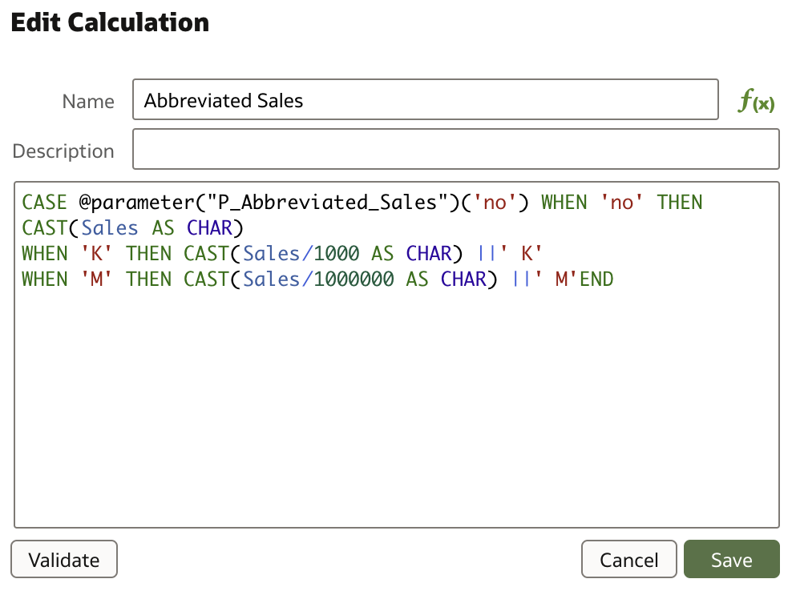
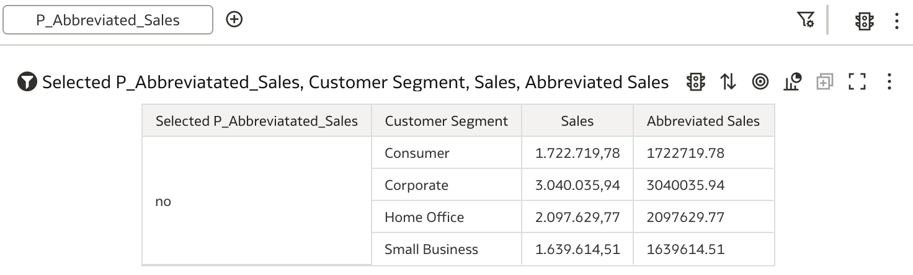
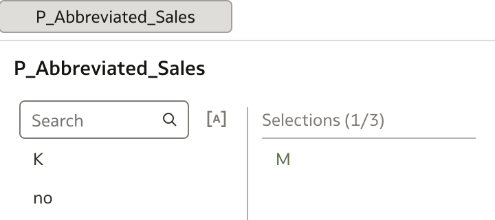
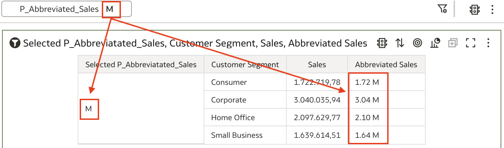

### Example #1: Using parameters in calculations (Expressions - CASE (Switch))

One of the simplest examples of using Parameters in Oracle Analytics is the following. Imagine that you want to abbreviate numeric values in a table. For example, instead of displaying full number 1.722.719,78 you might want to display value as 1.772,72K or 1,77M. By the way, Oracle Analytics provides this functionality out of the box.

In this case, two things need to happen:

* create a parameter which will store your selection ('no abbr.', 'K' or 'M') and
* calculation which would use parameter to divide a numeric value with 1000 or 1000000.

So, first, we need to create a new parameter. In your workbook you will find additional menu option **Parameters** at the top of the main panel.

You can create a new parameter simply by pressing **+** next to the **Search** field. Parameter that is created in this case is very simple, it is based on the list of values that is manually entered with the initial value set to one of these entered values.

And this is all that is required to define a parameter. Now, we need to create a calculation that would use this parameter.

In analysis below another calculation is created, simply to display selected parameter. For example, new table could look like this:

When creating a new data visualization, previously created parameter's values have to be selectable, hence it needs to be put in Filters tab, where user can select one of the values 'no', 'K' or 'M' ...

... and table is updated with the selected choice.

