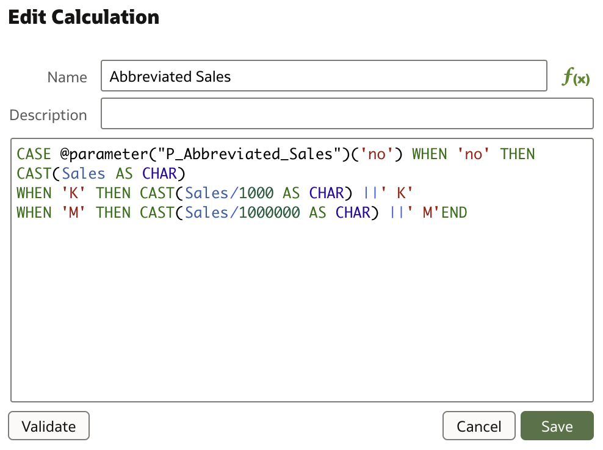
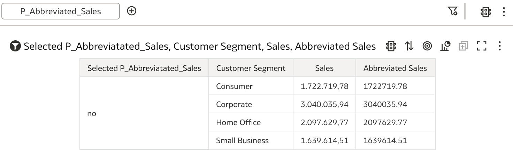
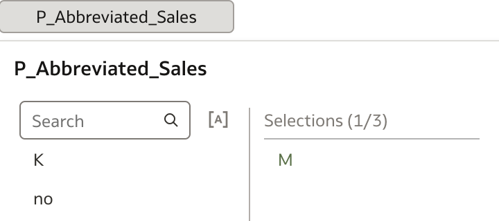
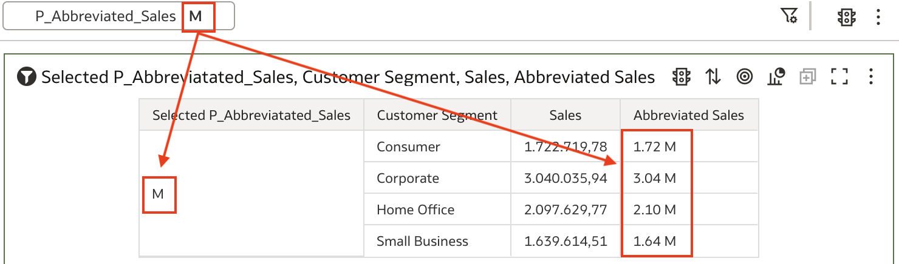

### Example #2: Using parameters in column filters

Another example of using parameters is with column filters.

For example, let's say that we need to present a sales table by product groups, but we are interested only in profit by specific customer segments. And we would like to calculate what is the share of that profit in total profit.

Again, we need to:

* create parameter which will be used for selection (in Filter tab) and
* calculation that would contain, column filter formula.

Additionally, one more calculation is needed to calculate profit % of total profit for selected customer segments.

Initial table shows Profit by Product Category.

Now, we need parameter that will be used for column filtering. This parameter is based on the list of values that is populated by using a logical SQL query. This query can be easily obtained if you run a query that displays all values for Customer Segment column and switch to **Developer** mode. Logical SQL query can be found under **Logical SQL** tab.

Logical SQL query needs to be copied into parameter definition. In this example, Initial Value can also be obtained by using same Logical SQL query.

A new parameter is copied into Filters tab, where selections can be made.

To be able to use newly created parameter, a new calculation is created.

And finally, test the results. In the first example, all values (default) are selected, and in the second example, only one customer segment is selected.

we need to create a new parameter. In your workbook you will find additional menu option **Parameters** at the top of the main panel.

You can create a new parameter simply by pressing **+** next to the **Search** field. Parameter that is created in this case is very simple, it is based on the list of values that is manually entered with the initial value set to one of these entered values.

And this is all that is required to define a parameter. Now, we need to create a calculation that would use this parameter.

In analysis below another calculation is created, simply to display selected parameter. For example, new table could look like this:

When creating a new data visualization, previously created parameter's values have to be selectable, hence it needs to be put in Filters tab, where user can select one of the values 'no', 'K' or 'M' ...

... and table is updated with the selected choice.

